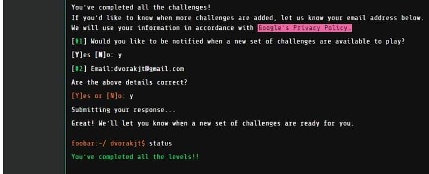

# My Foobar.withgoogle Journey 

## SPOILER ALERT!

If you are a developer and you haven't completed the foobar.withgoogle challenge but may want to do so in the future (or are currently working on it), please stop reading here!

## What is foobar.withgoogle?

foobar.withgoogle is a secret coding challenge from Google that you can discover by searching certain terms related to programming. I think I was looking up Java ArrayList methods. From what I have read about it, Google used to use it as means of hiring developers but stopped around 2020. Nonetheless, it is an incredibly fun challenge and you are lucky if you encounter it!

Each problem is timed, and there are five levels. Each level can have up to 3 problems.

## My journey

Welcome to my foobar.withgoogle journey! 

One night, I was working on solving coding challenges on Hackerrank or Codewars or some similar site, and was googling Java ArrayList methods, when suddenly none of the search results were clickable and a message had appeared at the top of my screen. It said something like "You're speaking our language" and "Curious developers might like to solve a problem from Google." 

Of course, I chose to attempt the challenge, and was presented with my first problem. I was able to solve it fairly quickly, and was hooked. Throughout the course of the journey, I was challenged to learn about absorbing Markov chains, combinatorics, group theory and Burnside's Lemma. I had to figure out how to simulate a laser beam bouncing around a room, and had to understand the limitations of my programming language of choice and how to navigate them when outputs exceeded twenty digits in length.

In this repository are my solutions to all of the problems together with the READMEs for each problem. Enjoy!

